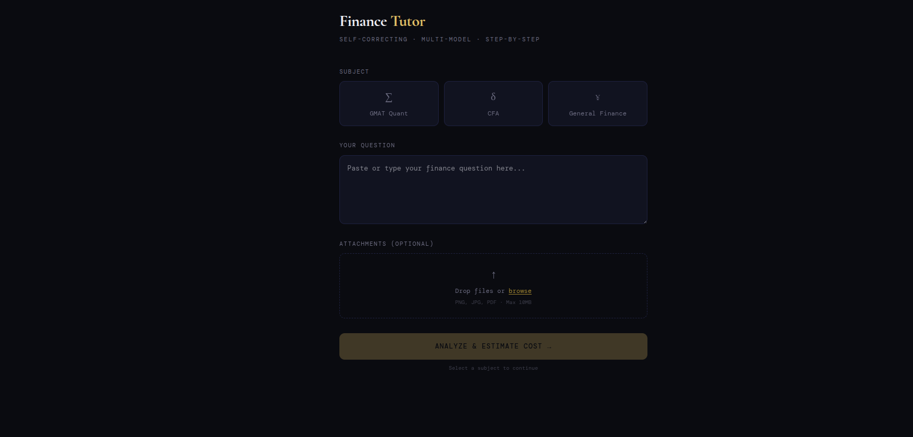

# Finance Tutor

**Self-correcting AI tutor that learns from its mistakes — classifies questions by difficulty, routes to the right model, and improves over time via a feedback loop stored in Supabase.**

Submit a question → Haiku classifies difficulty → the appropriate Claude model solves it step-by-step → you can submit the textbook answer → the system compares, logs its errors, and injects past mistakes into future prompts.

Supports 8 subjects (GMAT, CFA, Series 7, Series 24, Statistics, Accounting, Economics, General Finance), image/PDF uploads, Socratic guided mode, conversation follow-ups, practice question generation, and exportable performance reports.



**[Try the Live Demo →](https://finance-tutor-five.vercel.app/)**

---

## How It Works

```
Question → Classify (Haiku) → Route by difficulty → Solve (Haiku or Sonnet)
                                                          ↓
                                              User submits correct answer
                                                          ↓
                                              Compare (Haiku) → Log to Supabase
                                                          ↓
                                              Past mistakes injected into future solves
```

The self-correcting loop is the core idea: when Claude gets something wrong, the mistake type and lesson are stored in Supabase. On future questions in the same topic, those learnings are pulled into the system prompt — so the tutor avoids repeating the same errors.

## Architecture Decisions

- **Difficulty-based model routing** — Haiku classifies the question first, then routes easy questions to Haiku (cheap/fast) and medium/hard to Sonnet (accurate). Cost per question ranges from ~$0.001 to ~$0.02.
- **Cost transparency** — every API call's actual token cost is tracked and displayed to the user, broken down by classify/solve/compare/follow-up stages.
- **Structured output validation** — all LLM responses are parsed as JSON with error handling and retry logic.
- **Feedback as training data** — the compare step doesn't just check correctness; it categorizes the mistake type (arithmetic, wrong formula, conceptual, etc.) and extracts an actionable lesson.
- **Topic-adaptive prompting** — 41 topic-specific prompt templates (bond pricing, GMAT data sufficiency, options, accounting journal entries, etc.) are injected based on the classifier's topic tag.
- **Multi-modal input** — questions can be typed, uploaded as images (screenshots of textbook problems), or uploaded as PDFs. Files are sent to Claude as base64 content blocks.
- **Socratic mode** — "Guide me" mode uses a Socratic prompt that asks questions back instead of giving the answer, with multi-turn follow-ups.

**Stack:** Next.js · TypeScript · Claude API (Haiku 4.5 + Sonnet 4) · Supabase · Vercel

## Features

| Feature | Description |
|---------|-------------|
| 8 Subjects | GMAT Quant, CFA, General Finance, Series 7, Series 24, Statistics, Accounting, Economics |
| Image/PDF Upload | Photograph a textbook problem — Claude reads and solves it |
| Socratic Mode | "Guide me" gives hints and questions instead of the full answer |
| Follow-ups | Ask "what if the rate was 10%?" or "explain step 2 differently" in context |
| Topic Templates | 41 topic-specific prompt templates for structured, exam-quality answers |
| Practice Mode | Generate fresh practice questions by subject, difficulty, and topic |
| Learnings Dashboard | Accuracy by topic, error types, session history |
| Performance Report | Exportable HTML report showing tutor accuracy across all subjects |
| Cost Tracking | Per-call cost breakdown: classify, solve, compare, follow-ups |
| Self-Correcting Loop | Mistakes logged → lessons extracted → injected into future prompts |

## Project Structure

```
src/
├── app/
│   ├── page.tsx                 # Main UI (staged workflow)
│   └── api/
│       ├── classify/route.ts    # Difficulty classification → model selection
│       ├── solve/route.ts       # Solution generation with past-mistake injection
│       ├── compare/route.ts     # Answer validation + Supabase logging
│       ├── followup/route.ts    # Multi-turn conversation follow-ups
│       ├── practice/route.ts    # Practice question generation
│       ├── learnings/route.ts   # Dashboard stats + session history
│       └── export/route.ts      # HTML performance report export
├── components/
│   └── InputStep.tsx            # Question input form (subjects, mode, file upload)
└── lib/
    ├── claude.ts                # Claude API wrapper (single-turn + multi-turn)
    ├── supabase.ts              # Supabase client (nullable for graceful fallback)
    └── topicTemplates.ts        # 41 topic-specific prompt templates
```

## Quickstart

```bash
git clone https://github.com/AAP67/finance-tutor.git
cd finance-tutor
npm install
```

Create a `.env.local` file:

```
ANTHROPIC_API_KEY=your_key
NEXT_PUBLIC_SUPABASE_URL=your_supabase_url
NEXT_PUBLIC_SUPABASE_ANON_KEY=your_supabase_key
```

```bash
npm run dev
```

### Supabase Setup

Create a `learnings` table with columns: `subject`, `difficulty`, `topic`, `question`, `claude_answer`, `student_answer`, `comparison`, `was_correct` (bool), `mistake_type`, `lesson`, `created_at`.

## Built By

**[Karan Rajpal](https://www.linkedin.com/in/krajpal/)** — UC Berkeley Haas MBA '25 · LLM Validation @ Handshake AI (OpenAI/Perplexity) · Former 5th hire at Borderless Capital
